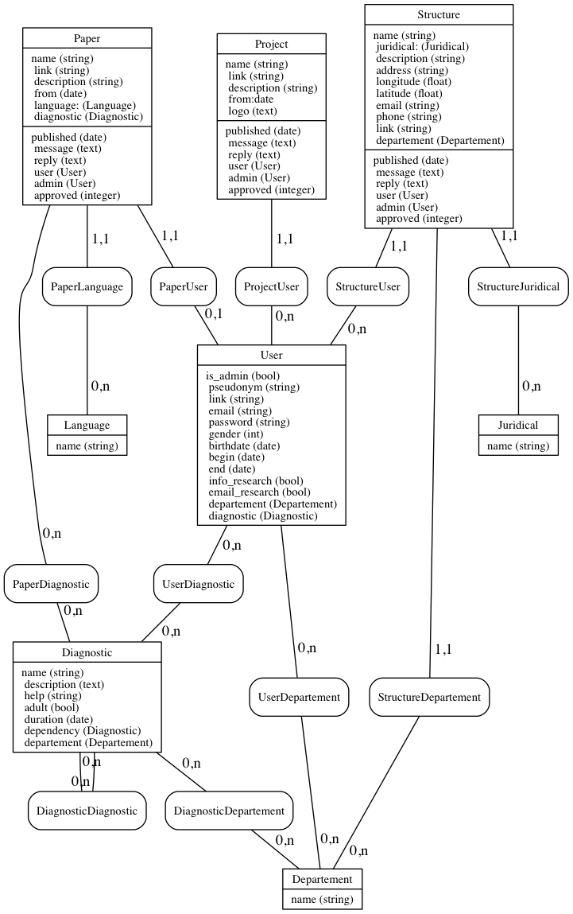

# Site-Ref

#### Merise'MCD-Modeling

#### Todo:
* *notation* from **Project** become *description:string* and must be regerated - @adjivas.
* *logo* was added to **Project** and must be generated.
* *info_research* was added to **User** and must be generated.
* *email_research* was added to **User** and must be generated.

#### License
**SiteRef**'s code in this repo uses the [GNU GPL v3](http://www.gnu.org/licenses/gpl-3.0.html) [license](LICENSE).
